# KUBERNETES SETUP WITH KUBERNETES OPERATIONS (KOPS)

**Kops** - **"Kubernetes Operations"**, is a command-line tool used for deploying, managing, and operating Kubernetes clusters on various cloud platforms. Kubernetes is an open-source container orchestration platform that helps manage the deployment, scaling, and operation of containerized applications.

Kops specifically focuses on simplifying the process of setting up and managing Kubernetes clusters on cloud infrastructure providers like Amazon Web Services (AWS), Google Cloud Platform (GCP), and others. It allows users to define and customize their Kubernetes clusters using configuration files, which makes it easier to maintain consistent and reproducible cluster configurations.

**Key features of Kops include:**

**Cluster Provisioning:** Kops helps automate the provisioning of infrastructure resources required for a Kubernetes cluster, such as virtual machines, networking, and storage.

**Cluster Upgrades:** Kops simplifies the process of upgrading Kubernetes clusters to newer versions, ensuring that the update process is seamless and minimizes downtime.

**Scaling:** Kops allows you to scale your cluster by adding or removing nodes, adjusting the resources allocated to nodes, and managing node groups.

**High Availability:** Kops supports configuring high availability features of Kubernetes, such as distributing master nodes across multiple availability zones, which enhances the resiliency of the cluster.

**Customization:** Users can define various cluster configurations, including node instance types, networking settings, add-ons, and other parameters, according to their requirements.

**Validation and Verification:** Kops includes tools for verifying the correctness of your cluster configuration and diagnosing potential issues before deploying the cluster.

In this instance, I will be configuring a Kubernetes cluster by employing the Kops tool.

**Prerequisites:**

- A domain name for Kubernetes DNS record - olami.uk.
- AWS account

**Task:**

- Log into AWS account:
    - Create an ubuntu Instance.
    - Create S3 bucket.
    - Create an IAM user for awscli.
    - Create Route 53 hosted zone.

- SSH into the instance

- Setup the following:
    - kops
    - kubectl
    - awscli
    - ssh keys

Purchase a domain name from a domain name provider. eg godaddy.com and namesilo.com etc.

Create an ubuntu EC2 instance for Kops 

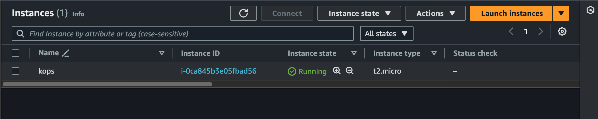

**Create S3 bucket**

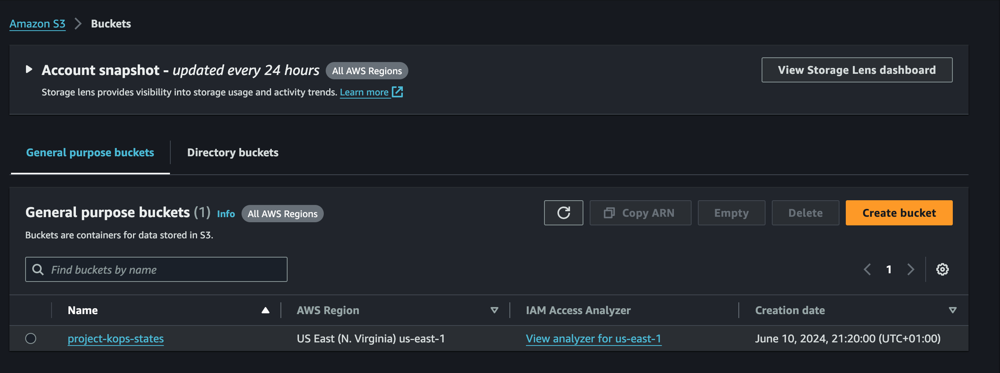

Kops will establish a cluster and utilize awscli for interaction with AWS services. To enable access to these services via awscli commands, valid credentials are essential.

Create an IAM role that will be endowed with administrator-level privileges for the kops instance. This IAM role is essential as it will interact with a wide range of services, including S3 buckets and Route53. Once this role is in place, the next step involves setting up the kops instance to utilize the associated access keys. I will named the user 'terraform'

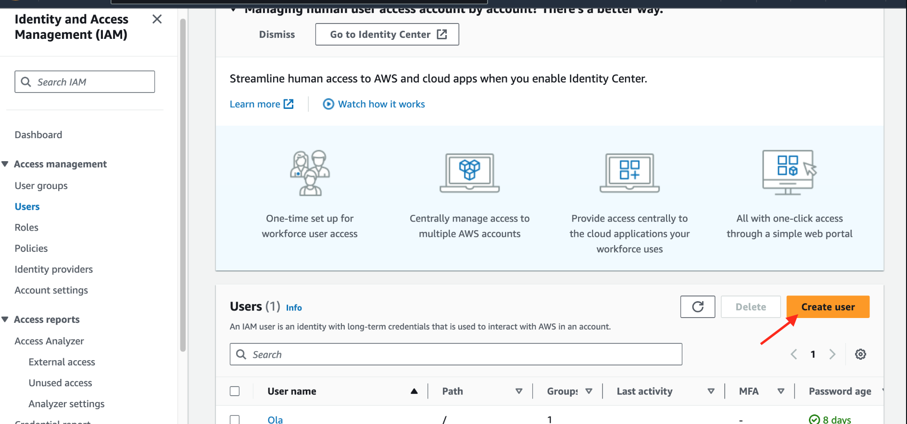

**Username: terraform**

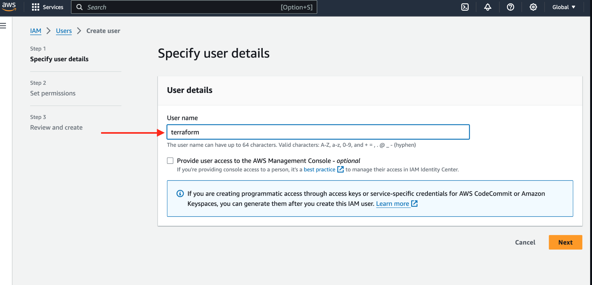

Give Admnistrator access > create user

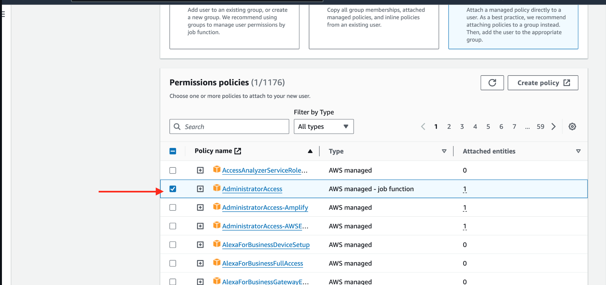

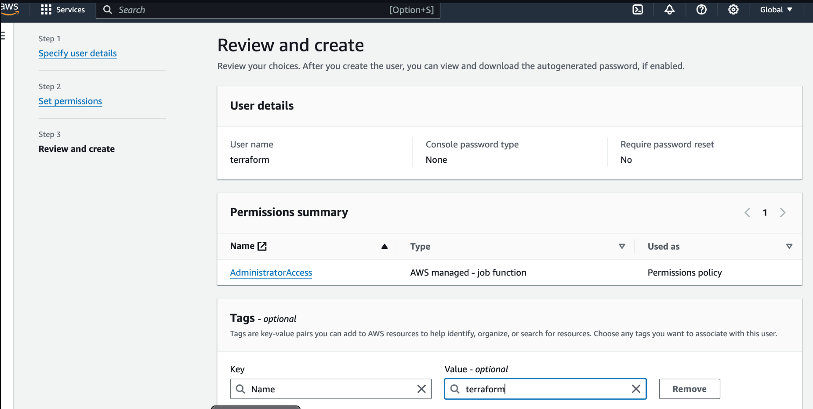

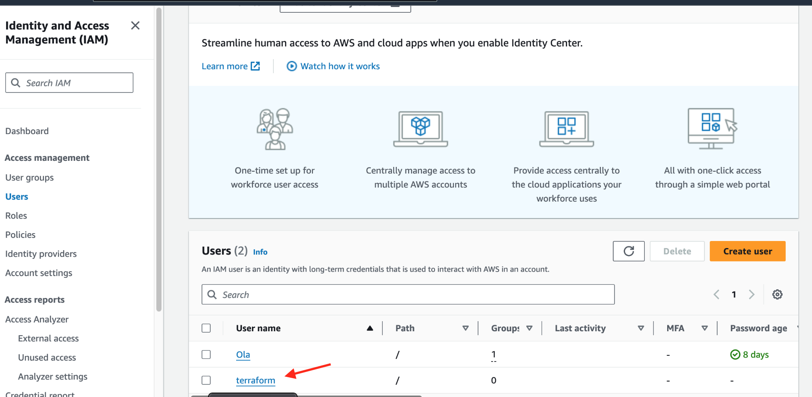

**Click on security credentials > Access Key > Command Line Interface (CLI) > create**

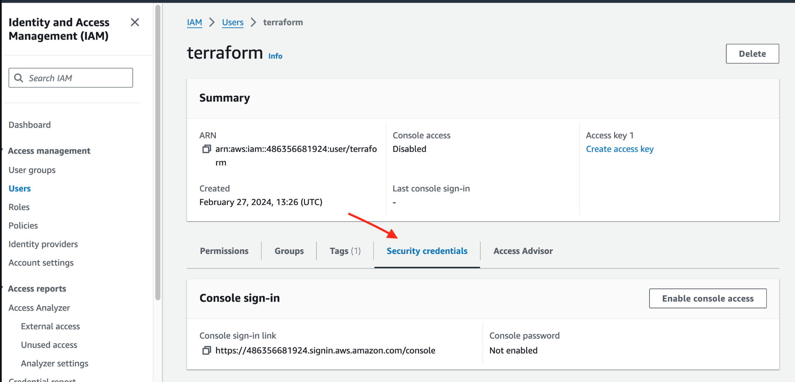
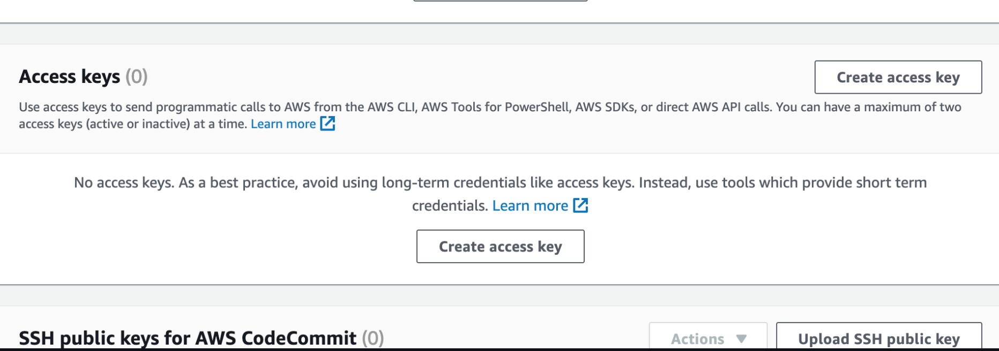
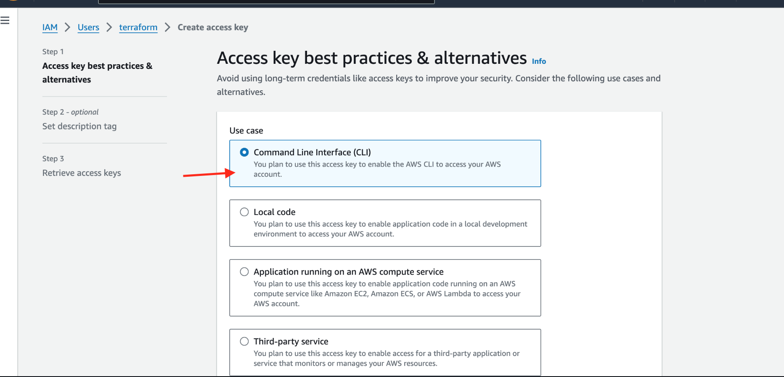
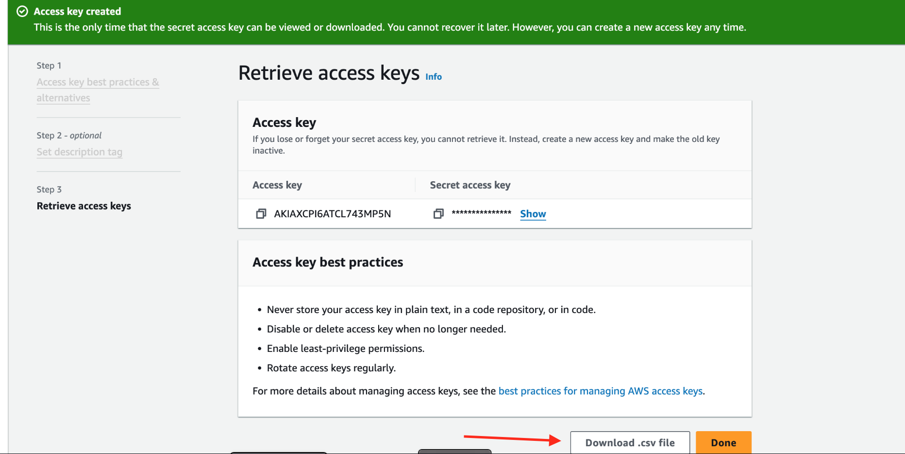

**The next thing is to configure our aws with security credentials we created**